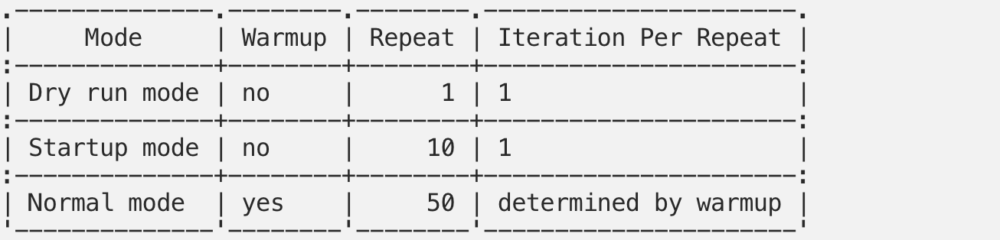
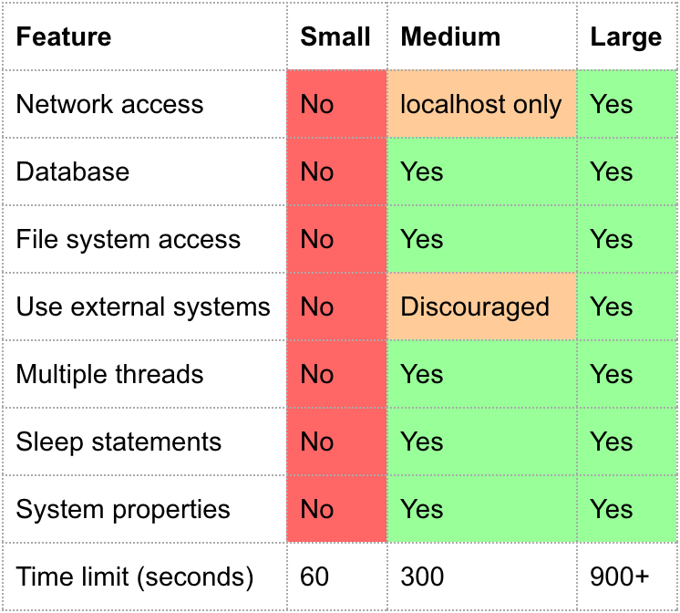
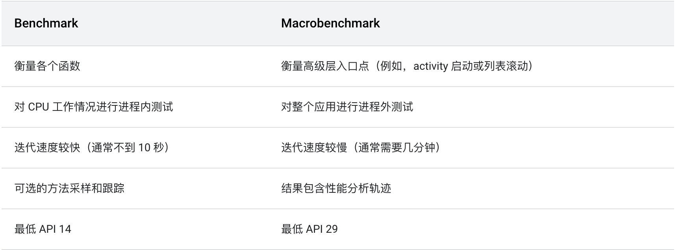

# JetPack Benchmark

## 为什么需要有Benchmark？

如果我们要测试代码的性能，我们会采用如下的打点方式：

```
@Test
fun codeMeasurement() {
    val start = java.lang.System.nanoTime() 
    doWork() 
    val elapsed = (java.lang.System.nanoTime() - start)     
    Log.d("measurement", "Time taken was $elapsed ns")
}
```

或者为了降低随机干扰带来的误差，计算平均值：

```
@Test
fun codeMeasurement() {
    val COUNT = 5 
    val start = java.lang.System.nanoTime() 
    for (i in 0..COUNT) {
        worker.doWork() 
    }
    val elapsed = (java.lang.System.nanoTime() - start) / COUNT
    Log.d("measurement", "Time taken was $elapsed ns")
}
```

这个的缺陷：

* 由于硬件和软件环境的不同，我们每次得到的结果并不一样，如何保证结果一致性？
* COUNT的值怎么定才算合理？
* 如何避免其他后台任务对测试的影响？

## JetPack Benchmark如何克服如上问题？

> We can say that Benchmarking is a process that is used to measure how fast your phone can run something in it. The idea is to put your phone to enough stress so that you can find the maximum performance of your app on your phone.

说白了就是在手机极限的情况下看看app的最大性能。

### 去掉来自其他界面的干扰

例如如下的一些界面干扰：

* live wallpaper rendering：壁纸
* homescreen widget updates：主屏挂件
* hotword detection：
* status bar repaints：状态栏
* running in background (some cores may be foreground-app only)：后台任务

这个的实现是在`AndroidBenchmarkRunner`：

```
open class AndroidBenchmarkRunner : AndroidJUnitRunner() {

    @CallSuper
    override fun waitForActivitiesToComplete() {
        var isResumed = false
        runOnMainSync {
            isResumed = IsolationActivity.resumed
        }
        if (!isResumed) {
            IsolationActivity.launchSingleton()
        }
    }
  .....
}
```

### 稳定的CPU频率

cpu的频率会根据温度的不同有所变化，这样会导致不稳定的benchmark结果。所以cpu的频率波动应该最小。那怎么做呢？

#### Lock Clock

**这个需要root权限。**

可以运行`gradlew lockClocks`，这样会执行[LockClocksTask](https://android.googlesource.com/platform/frameworks/support/+/f2e05c341382db64d127118a13451dcaa554b702/benchmark/gradle-plugin/src/main/kotlin/androidx/benchmark/gradle/LockClocksTask.kt) ，task会将`lockClocks.sh`推送到手机上执行。

```
open class LockClocksTask : DefaultTask() {
    init {
        group = "Android"
        description = "locks clocks of connected, supported, rooted device"
    }
    @Input
    val adbPath: Property<String> = project.objects.property()
    @Suppress("unused")
    @TaskAction
    fun exec() {
        val adb = Adb(adbPath.get(), logger)
        adb.execSync("root", silent = true, shouldThrow = false)
        val isAdbdRoot = adb.isAdbdRoot()
        val isRooted = isAdbdRoot || adb.isSuInstalled()
        if (!isRooted) {
            throw GradleException("Your device must be rooted to lock clocks.")
        }
        val dest = "/data/local/tmp/lockClocks.sh"
        val source = javaClass.classLoader.getResource("scripts/lockClocks.sh")
        val tmpSource = Files.createTempFile("lockClocks.sh", null).toString()
        Files.copy(
            source.openStream(),
            Paths.get(tmpSource),
            StandardCopyOption.REPLACE_EXISTING
        )
        adb.execSync("push $tmpSource $dest")
        // Files pushed by adb push don't always preserve file permissions.
        adb.execSync("shell chmod 700 $dest")
        // Forward gradle arguments to lockClocks.sh.
        val coresArg = project.findProperty("androidx.benchmark.lockClocks.cores")
        if (!isAdbdRoot) {
            // Default shell is not running as root, escalate with su 0. Although the root group is
            // su's default, using syntax different from "su gid cmd", can cause the adb shell
            // command to hang on some devices.
            adb.execSync("shell su 0 $dest ${coresArg ?: ""}")
        } else {
            adb.execSync("shell $dest ${coresArg ?: ""}")
        }
        adb.execSync("shell rm $dest")
    }
}
```

这个执行后，`sys/devices/system/cpu/cpux/cpufreq/scaling_maxfreq` 和 `sys/devices/system/cpu/cpux/cpufreq/scaling_minfreq`会被设置成一个合适的值，从而降低波动。

#### Sustained performance mode

从android 7.0开始，支持持久的性能模式。在该模式下，cpu将运行在温和的速率下（即不会在最大时钟频率运行），这样设备就不容易过热并且性能能够在长时间下保持在稳定的状态。

具体实现是在`IsolationActivity.java`，如果Lock Clock不支持并且设备支持持久性能，那么久开启持久的性能模式。

```
if (!CpuInfo.locked && isSustainedPerformanceModeSupported()) {
    sustainedPerformanceModeInUse = true
}

private val activityLifecycleCallbacks = object : Application.ActivityLifecycleCallbacks {
            @SuppressLint("NewApi") // window API guarded by [isSustainedPerformanceModeSupported]
            override fun onActivityCreated(activity: Activity, bundle: Bundle?) {
                if (sustainedPerformanceModeInUse) {
                    activity.window.setSustainedPerformanceMode(true)
                }
            }
}
```

### Benchmark Thread  Priority

在test开始前，Benchmark Thread的优先级将会被设置到最高级别，而JIT的优先级则会改为比Benchmark Thread低，以此减小JIT的影响。

这个具体代码在`ThreadPriority.kt`：

```
fun bumpCurrentThreadPriority() = synchronized(lock) {
    val myTid = Process.myTid()
    if (initialTid == myTid) {
        // already bumped
        return
    }

    // ensure we don't have multiple threads bumped at once
    resetBumpedThread()

    initialTid = myTid
    initialPriority = Process.getThreadPriority(initialTid)

    setThreadPriority("Bench thread", initialTid, BENCH_THREAD_PRIORITY)
    if (JIT_TID != null) {
        setThreadPriority("Jit", JIT_TID, JIT_THREAD_PRIORITY)
    }
}
```

## JetPack Benchmark状态

Benchmark有四个生命周期：

* NOT_STARTED
* WARMUP
* RUNNING
* FINISHED


根据不同的状态会上面的生命周期会会有所不同：

* Dry run mode：没有warmup阶段，只跑1次，一般用来检查
* Startup mode：没有warmup阶段，跑10次，1次循环
* Normal mode：有warmup阶段，跑50从，N次循环




## 使用场景

* 测试的代码应该是同步的
* 应该是小的代码段

## 其他内容

* @SmallTest
* @LargeTest
* @MediumTest



* 小：此测试不与任何文件系统或网络交互。
* 中：访问正在运行测试的框上的文件系统。
* 大：访问外部文件系统，网络等。

小测试应该<100ms，中等测试<2s，大测试<120s。

## Macrobenchmark

与 Jetpack Benchmark 库不同，Macrobenchmark 适用于测试较大的用例，而非小块代码。



Macrobenchmark的具体使用可以参考：[MacrobenchmarkSample](https://github.com/android/performance-samples/tree/main/MacrobenchmarkSample)

## 参考

[Improving Android app performance with Benchmarking](https://blog.mindorks.com/improving-android-app-performance-with-benchmarking)

[Going Deep on JetPack Benchmark](https://proandroiddev.com/going-deep-on-androidx-benchmark-d06b89765f9e)

[benchmarking](https://developer.android.com/studio/profile/benchmarking-overview)